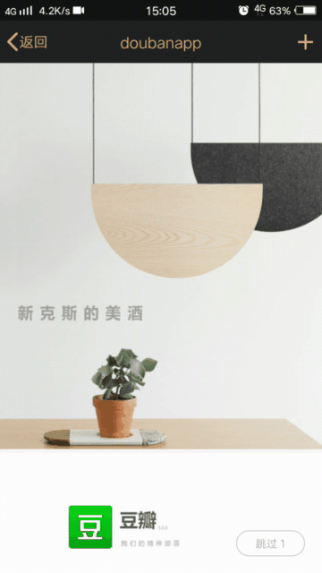

# vue2.0开发的仿豆瓣APP

# dome
[用手机查看获得最佳效果](https://xiaoke0402.github.io/)
这个项目只对移动端进行适配，对PC端不做任何处理。
## 用到的技术栈 vue2.0 vuex vue-router sass vue-awesome-swiper fastclick flexible

## 项目截图
 
 
 
  
# 总结
* 用某宝的flexible 做移动端的适配布局方案
* vue-awesome-swiper 轮播图插件
* fastclick 解决移动端点击延迟300s的问题
* 由于没有后端API自己写的本地json数据做伪后台数据（- -自己写数据真的很没意思啊）
* 由于没有后台数据只能做简单的登入退出展示，而自己又懒得再去写二级页面的交互（没有数据真的好烦~）
* vuex真的很好用。虽然本项目的数据交互不是很多但是深切的体会到vuex在状态管理方面的优势和方便。
## Build Setup

``` bash
# install dependencies
npm install

# serve with hot reload at localhost:8080
npm run dev

# build for production with minification
npm run build

# build for production and view the bundle analyzer report

